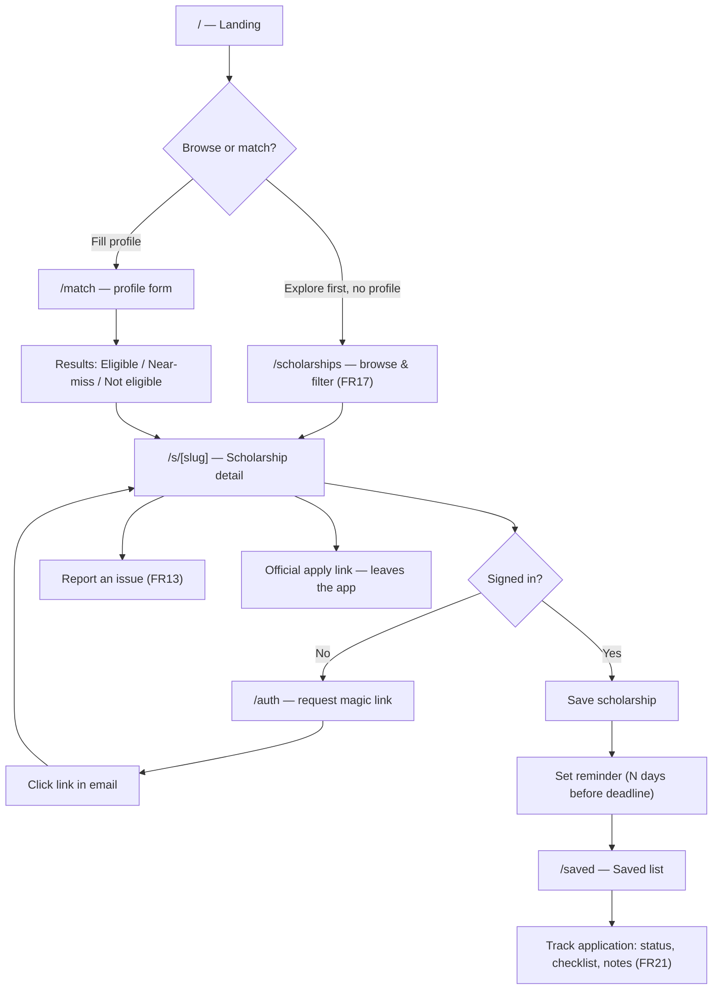

# Iskolarly — App Flow

_The user's path through the app: screens and transitions, not routes and code. For the route/action inventory behind each step, see `ARCHITECTURE.md` §3–4; for the underlying data, `backend-schema.md`._

**Companion to:** `PRD.md`, `ARCHITECTURE.md`, `app-flow.md`'s sibling docs
**Personas:** Ana (17, graduating senior), Marco (19, college student) — `PRD.md` §1.4; Curator (admin)
**Status:** Reflects the app as built (FR1–FR22)

---

## 1. Core Flow — Discover → Match → Save → Remind

No account is required through step F — browsing and matching are anonymous by design (`PRD.md` §1.3, SEC-G1). The account gate only appears at "save."

## 2. Anonymous Match Flow (FR1, FR2)

1. Student opens `/match`, fills the profile form (education level, GWA, course field, region, income bracket, special statuses) — no account.
2. Submit runs `submitProfileForm` → `matchProfile` server-side; nothing is persisted.
3. Results render in three buckets: **Eligible**, **Near-miss** (fails exactly one mandatory rule, shows curator-authored "how to qualify" guidance — FR14), **Not eligible** (shows all failed rules — FR15).
4. Each card shows deadline urgency, matched reasons, and links to the detail page.

## 3. Browse & Filter Flow (FR17)

An alternative entry that skips the profile form entirely:

1. `/scholarships` — filter by coverage type, provider type, region, deadline status, or keyword, via a zero-JS `<form method="get">`.
2. Results link to the same `/s/[slug]` detail pages as the match flow.
3. From any result set (match or browse), the student can select 2–3 items and open a side-by-side comparison (FR16, client-side only).

## 4. Auth Flow (FR6)

1. `/auth` — student enters email, requests a magic link (rate-limited 5 req/60s/IP).
2. Supabase sends an email; clicking the link hits `/auth/confirm`, which verifies the OTP and redirects back to the page the student was on (sanitized same-site `next` param).
3. No password, no separate signup step — first magic-link use creates the account.

## 5. Save, Remind & Track Flow (FR7, FR8, FR21)

1. From a detail page (signed in), student taps **Save** → row in `saved_scholarships`.
2. Student sets a reminder → `remind_on` computed from the soonest open deadline cycle minus lead days.
3. `/saved` lists everything saved, each row showing: reminder state, a requirement-progress bar (`done/total`), and an application-status control (`interested → preparing → applied → submitted`).
4. Toggling requirement checkboxes on the detail page persists to `requirement_checkoffs` for signed-in users (ephemeral for anonymous visitors — no login wall).
5. A short private note (≤1000 chars) can be attached per scholarship.

## 6. Report an Issue Flow (FR13)

1. On `/s/[slug]`, student submits a reason (stale info / broken link / wrong deadline / other) + optional detail + optional email.
2. Goes straight to the curator moderation queue — no account required, no data shown back to other students.
3. Curator resolves it at `/admin/reports` (see §8).

## 7. Sharing & Notification Opt-ins (FR18, FR19, FR20)

- **Push (FR18):** from `/saved`, student opts into Web Push; reminders are then sent via email **and** best-effort push.
- **Share (FR19):** student generates a read-only link at `/shared/[slug]` (random slug) to send to a parent or counselor; regenerating invalidates the old link.
- **Digest (FR20):** student explicitly opts in on `/match` (only path that persists a profile — the sole exception to the zero-persisted-profile posture) to get a weekly "new matches for you" email.

## 8. Curator (Admin) Flow

1. Curator signs in via the same `/auth` magic-link flow; must already have a row in `admin_users` (granted manually, no self-service).
2. `/admin` — dashboard of scholarships, inline "mark verified."
3. `/admin/providers` — add/edit a provider before attaching scholarships to it.
4. `/admin/scholarships/new` → `/admin/scholarships/[id]/edit` — create a draft, then attach eligibility rules (incl. FR14 guidance text), requirements, and deadline cycles.
5. **Mark verified** stamps `last_verified_at` + `verified_by` — required before publish (DB-enforced `scholarships_publish_guard`).
6. **Publish** flips `is_published = true`, making it visible to `anon`/`authenticated`.
7. Ongoing maintenance loops:
   - `/admin/worklist` (FR12) — records nearing/past the 60-day staleness threshold, sorted by urgency.
   - `/admin/reports` (FR13) — resolve student-submitted issue flags.
   - `/admin/suggestions` (FR10) — review per-field changes proposed by the weekly source-watcher; approve routes through the same validated update actions, reject discards.
   - `/admin/discoveries` (FR22) — review brand-new scholarship candidates found by the discovery crawler; promote continues at step 4 as a draft, reject discards.
   - `/admin/source-pages` — register/manage the official index pages the discovery crawler watches.

Every mutation in this flow writes an `audit_log` row.

## 9. Background (System) Flows

Not user-initiated — five Vercel Cron jobs keep data and notifications current. All Asia/Manila-pinned times.

| Job | Schedule | What happens | User-visible effect |
| --- | --- | --- | --- |
| `refresh-deadlines` | Daily ~00:00 | Recompute every `deadline_cycles.status` | Cards/detail pages show correct open / closing_soon / closed |
| `send-reminders` | Daily ~00:15 | Email (Resend) + best-effort Web Push for due reminders | Student reminded before deadline |
| `send-digest` | Weekly Mon ~00:30 | Re-run matching for opted-in `saved_profiles`, email new matches only | Student gets a "new matches for you" email (opt-in only) |
| `watch-sources` | Weekly Mon ~00:45 | Re-fetch published scholarships' official pages, diff, file field-level suggestions | Curator sees new items in `/admin/suggestions` |
| `discover-sources` | Weekly Mon ~01:00 | Crawl registered index pages, extract new-scholarship candidates | Curator sees new items in `/admin/discoveries` |

None of these auto-publish anything a curator hasn't reviewed (§8).
