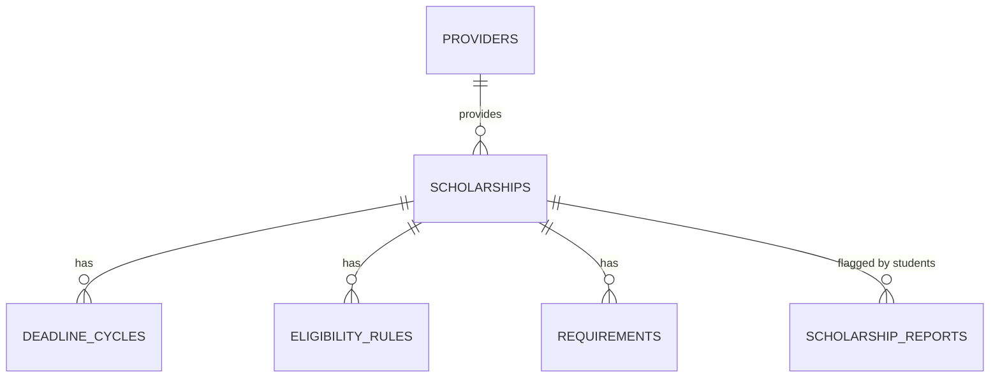
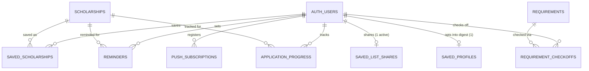
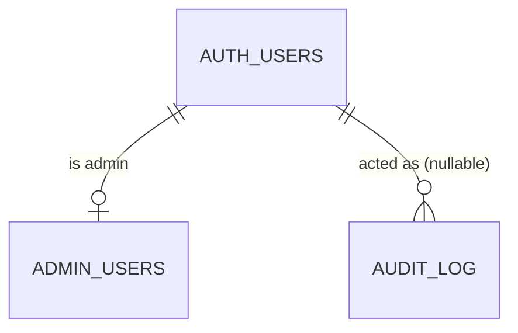
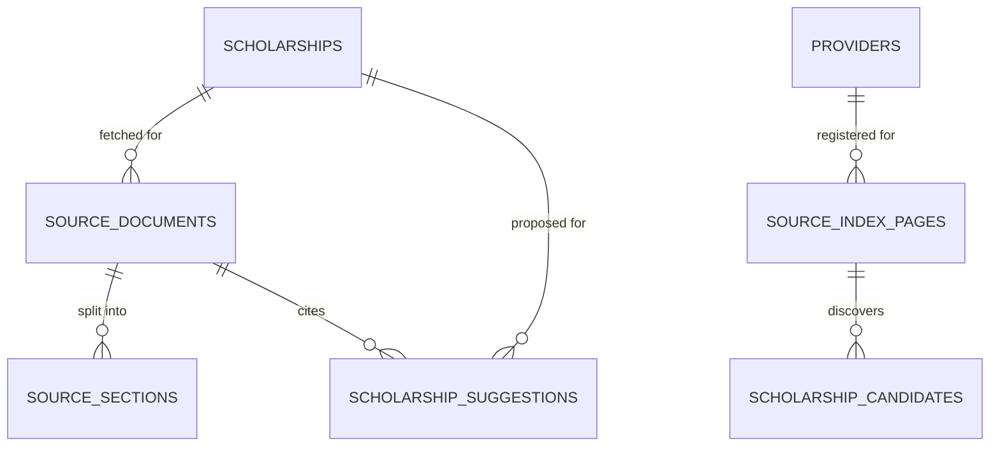

# Iskolarly — Backend Schema (Quick Reference)

_Visual/summary companion to `DATABASE.md`. This doc is for orientation — column types, CHECK constraints, index definitions, RLS policy SQL, and known gaps all live in `DATABASE.md`, not duplicated here._

**Companion to:** `DATABASE.md` (authoritative), `ARCHITECTURE.md`, `SECURITY.md`
**Stack:** PostgreSQL via Supabase, 21 tables, migrations `20260101000001`–`20260101000014`
**Status:** Reflects the app as built

---

## 1. Roles & Trust Model

| Role | Access |
| --- | --- |
| `anon` | Read-only; only rows an RLS `select` policy exposes (published scholarships + children). No write policy exists for this role, anywhere. |
| `authenticated` | Same public reads, plus owner-scoped CRUD on their own `saved_scholarships`, `reminders`, `push_subscriptions`, `saved_list_shares`, `saved_profiles`, `application_progress`, `requirement_checkoffs`; a self-read on `admin_users`. |
| `service_role` | Bypasses RLS. Server-only (server actions, cron handlers). The only role that can write `providers`, `scholarships`, `eligibility_rules`, `requirements`, `deadline_cycles`, `allowlisted_domains`, `admin_users`, `audit_log`, and all source-watcher/discovery tables. |

Every table has RLS **enabled** — access is enforced at the database layer, not by app code discipline alone.

## 2. Entity Diagrams

### Core content (anon-readable when published)

### User-owned (RLS: `auth.uid()` owner-only)

### Admin & audit (service-role write; self/admin read only)

### Source-watcher (FR10) & discovery (FR22) — service-role only, zero client policies

## 3. Table Reference

### Core content — service-role writes only, `anon`/`authenticated` read published rows

| Table | Purpose | Key relationships |
| --- | --- | --- |
| `providers` | Scholarship-granting org (government/LGU/private/university) | Referenced by `scholarships.provider_id` |
| `scholarships` | The scholarship record — title, coverage, official/apply URLs, publish + verification state | FK → `providers`; parent of rules/requirements/cycles |
| `deadline_cycles` | One application window per scholarship, with app-computed `status` | FK → `scholarships`, cascade |
| `eligibility_rules` | One matching rule per (scholarship, field) — field/operator/value, mandatory flag, FR14 guidance text | FK → `scholarships`, cascade |
| `requirements` | One checklist item per scholarship | FK → `scholarships`, cascade |

### Security / moderation — RLS enabled, **zero policies** (default-deny even for `authenticated`)

| Table | Purpose |
| --- | --- |
| `allowlisted_domains` | Curated foundation domains beyond `*.gov.ph`/`*.edu.ph` (currently empty) |
| `scholarship_reports` (FR13) | Curator moderation queue for student "report an issue" flags — the app's first anon-facing write, submitted via a service-role server action, never a client insert policy |

### User-owned — RLS: owner-only via `auth.uid()`

| Table | Purpose | Mutable? |
| --- | --- | --- |
| `saved_scholarships` | A student's bookmarked scholarships | Insert/delete only — immutable rows |
| `reminders` | One reminder per (user, scholarship); `remind_on` app-computed | Full CRUD |
| `push_subscriptions` (FR18) | Web Push endpoint registration | Insert/delete only |
| `saved_list_shares` (FR19) | One active share slug per user | Upsert (regenerate replaces) |
| `saved_profiles` (FR20) | Opt-in digest — the **sole** persisted-profile exception (SEC-G1) | Full CRUD |
| `application_progress` (FR21) | Per-scholarship status (`interested→preparing→applied→submitted`) + private note | Full CRUD |
| `requirement_checkoffs` (FR21) | Persisted requirement checklist — presence = checked | Insert/delete only |

### Admin — service-role writes; `authenticated` gets self/admin-scoped reads only

| Table | Purpose |
| --- | --- |
| `admin_users` | Binary curator membership; self-read only, no self-service signup |
| `audit_log` | Append-only trail of every admin mutation; admin-read via `is_admin()` `SECURITY DEFINER` function |

### Source-watcher (FR10) — keeps existing records current

| Table | Purpose |
| --- | --- |
| `source_documents` | One row per fetch of a scholarship's official page (history retained) |
| `source_sections` | Heading-delimited, independently hashed sections — the change-gate compares hashes, no embeddings |
| `scholarship_suggestions` | Field-level proposed changes, curator-approved before anything applies |

### Source-discovery (FR22) — finds new scholarships

| Table | Purpose |
| --- | --- |
| `source_index_pages` | Curator-registered official index/listing pages the crawler reads |
| `scholarship_candidates` | Draft new-scholarship records awaiting curator promotion/rejection |

### Deliberately absent

- **`student_profiles`** — anonymous matching persists nothing; this table does not exist by design (RA 10173 data minimization). Not to be confused with `saved_profiles` above.

## 4. Key Invariants

- **Publish guard:** `scholarships_publish_guard` CHECK blocks `is_published = true` unless `official_url` and `last_verified_at` are both set.
- **URL allowlist:** enforced independently at three layers (Zod, Postgres trigger `enforce_scholarship_url_allowlist`, and the discovery-table trigger) — `*.gov.ph`/`*.edu.ph` suffix match, dot-boundary anchored.
- **No anon write policy exists on any table, anywhere** — including `scholarship_reports` (FR13), the app's first anon-facing write, which goes through a service-role server action instead of a client insert policy.
- **A policy is not a grant.** Every RLS-policy'd table also needs a `GRANT` (`20260101000006_grant_table_privileges.sql`) — missing one causes silent `permission denied` that only `tests/integration/rls.test.ts` catches.
- **Shared saved lists** (FR19) are only ever readable through `get_shared_saved_list()`, a `SECURITY DEFINER` RPC returning a narrow column allowlist — never a direct table policy.
- **Migrations are forward-only** — a schema mistake gets a new migration, never an edited/rebased one.

## 5. Where to Look Next

- Full column definitions, CHECK constraints, indexes, RLS policy SQL, functions/triggers, and known gaps: **`DATABASE.md`**.
- Security posture and threat model behind these controls: **`SECURITY.md`**.
- How these tables map to routes/server actions: **`ARCHITECTURE.md`** §3–4.
